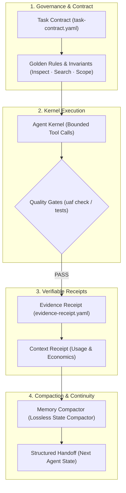
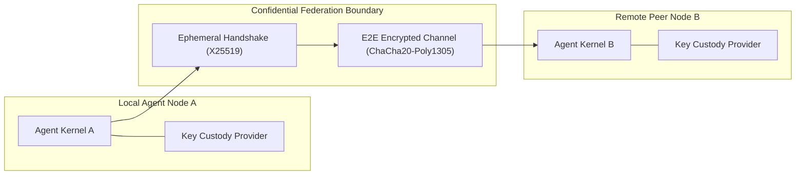
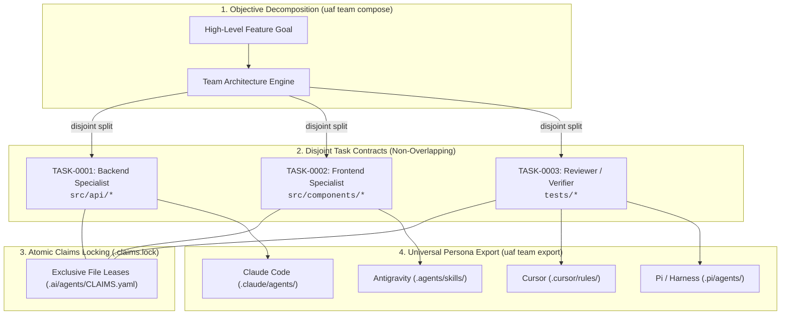

# Universal AI Agent Framework (UAAF)

[](https://github.com/lunarcwhite/agentic-workflow-framework/actions/workflows/ci.yml)
[](https://lunarcwhite.github.io/agentic-workflow-framework/)
[](https://github.com/lunarcwhite/agentic-workflow-framework/releases)
[](https://www.python.org/)
[](https://opensource.org/licenses/MIT)
[](./spec)

UAAF is an open protocol, reference knowledge scaffold, and secure runtime for autonomous AI coding agents. It prevents silent drift, enforces anti-slop constraints, anchors verifiable evidence, and enables decentralized multi-agent federation.

---

## 🏛️ Architecture & Core Lifecycle

### 1. Deterministic Agent Execution Lifecycle



### 2. Federated Multi-Agent Cryptographic Boundary



### 3. Local Multi-Agent Team Architecture & Disjoint Perimeters



---

## ⚡ Quick Start


### Installation

Clone the repository and install the CLI:

```bash
git clone https://github.com/lunarcwhite/agentic-workflow-framework.git
cd agentic-workflow-framework
pip install -e .
```

Verify installation:
```bash
uaf --help
```

*(Alternatively, run without installation using `python tools/uaf.py ...`)*

---

## 📁 Repository Structure

| Directory / File | Description |
| :--- | :--- |
| [`tools/`](./tools) | Distribution CLI (`uaf`), initializer, validators, memory compaction, and federation runtime. |
| [`scaffold/`](./scaffold) | Project-side template (`.ai/`) provisioned into user projects. |
| [`docs/`](./docs) | Official landing page & interactive documentation hosted on GitHub Pages. |
| [`spec/`](./spec) | Normative specifications (`UAAF-v1.0-MASTER-SPEC.md`, `v2.0`, `v3.0-ADDENDUM.md`, etc.). |
| [`templates/`](./templates) | Standardized task contracts, evidence receipts, context receipts, and handoffs. |
| [`tests/`](./tests) | Conformance test suite, longitudinal tests, and field archetype validations. |
| [`reports/`](./reports) | Comprehensive historical validation, implementation, and field reports. |
| [`examples/`](./examples) | Reference implementation examples (e.g. Northstar, confidential transport). |

### 🏷️ Historical Releases & Tags

All 23 historical releases (from `v1.0.0` up to `v3.0.0`) are permanently preserved in Git tags and GitHub Releases. You can inspect or checkout any past version without bloating the working tree:

```bash
# List all release tags
git tag -l

# Checkout a specific historical version
git checkout v2.0.0
```

Release assets and changelogs are also accessible directly via [GitHub Releases](https://github.com/lunarcwhite/agentic-workflow-framework/releases).

---

## 🛠️ Initialize a Project

Initialize UAF into any new or existing project:

```bash
# Standard profile (recommended for general projects)
uaf init ./my-project --profile standard --auto-detect

# Full profile with Team Orchestrator, Plugin Marketplace & Native SEO Governance v3.3.0
uaf init ./my-project --profile full --extension v3.3.0
```

Use `--docs all` for the complete documentation catalog or `--docs none` to omit `docs/`.

The v1.5 Context Receipt template supports optional `estimated_tokens` and declared `usage` fields for observability; these contain metadata only.

## Extensions

Versions are cumulative. Selecting a later version includes earlier extension layers.

### v3.2 — Agentic Plugin Marketplace & Domain Specialists

v3.2 introduces protocol `UAAF-PLUGIN-1.0`, connecting UAAF to large-scale agentic plugin and skill ecosystems (such as [`wshobson/agents`](https://github.com/wshobson/agents)). It provides automated governance auditing, dynamic team role discovery, and domain-specialist adaptation.

> 📖 **Normative Specification**: See [UAAF-v3.2-EXTENSIONS.md](./spec/UAAF-v3.2-EXTENSIONS.md).

#### Core Capabilities
- **Curated & Remote Discovery**: `uaf plugin search <query>` inspects the built-in catalog or queries GitHub registries.
- **Governed Scaffolding**: `uaf plugin install <name>` downloads plugins, establishes `.ai/plugins/<name>/`, and automatically writes `GOVERNANCE.md` while anchoring cryptographic evidence receipts.
- **Dynamic Team Role Discovery**: `uaf team compose` automatically detects installed plugin roles and maps prompt keywords to domain specialists (`fastapi_pro`, `react_pro`, `postgresql_dba`, `devops_engineer`, `testing_specialist`).
- **Universal Multi-Target Export**: `uaf plugin export <name> --target all` emits native formats for Claude Code, Antigravity, Cursor, and Pi.

```bash
# 1. Search for specialized plugins & agents
python tools/uaf.py plugin search fastapi
python tools/uaf.py plugin search security

# 2. Install and govern plugins into .ai/plugins/
python tools/uaf.py plugin install python-development
python tools/uaf.py plugin install security-audit

# 3. Export plugin personas across harnesses
python tools/uaf.py plugin export python-development --target all
```

### v3.1 — Team-Architecture Factory & Multi-Agent Orchestrator

v3.1 introduces protocol `UAAF-TEAM-1.0` allowing multiple heterogeneous coding agents (Claude Code, Google Antigravity, Cursor, Open Code, and Pi) to collaborate simultaneously without merge collisions or unpermitted scope expansion.

> 📖 **Comprehensive Guide**: See the complete [Multi-Agent Team Orchestration Guide](./docs/MULTI-AGENT-TEAM-GUIDE.md) and normative specification [UAAF-v3.1-EXTENSIONS.md](./spec/UAAF-v3.1-EXTENSIONS.md).

#### The 6 Architectural Patterns

| Pattern | Topology | Default Roles | Best Suited For |
|---|---|---|---|
| `pipeline` | Sequential chain | `architect` &rarr; `engineer` &rarr; `reviewer` &rarr; `verifier` | Migrations, refactoring, linear feature delivery |
| `producer_reviewer` | Iterative pair | `producer`, `reviewer` | High-assurance bug fixes, security patches |
| `fan_out_fan_in` | Parallel domain split | `coordinator`, `backend_specialist`, `frontend_specialist`, `integrator` | Full-stack features, high-throughput tasks |
| `expert_pool` | Subsystem dispatch | `planner`, `domain_expert`, `security_auditor`, `qa_engineer` | Mission-critical algorithms, security audits |
| `supervisor` | Hierarchical delegation | `supervisor`, `worker_primary`, `worker_secondary` | Iterative backlog processing, release management |
| `hierarchical` | Multi-tier enterprise | `lead_architect`, `system_engineer`, `qa_lead`, `compliance_officer` | Monorepos, large complex codebases |

#### Core Invariants
- **Disjoint Perimeter Invariant**: Automatic prompt decomposition guaranteeing $\text{permitted\_files}(A) \cap \text{permitted\_files}(B) = \emptyset$. No two agents can touch the same file concurrently.
- **Atomic Claim Leasing**: Safe lock management via `.ai/agents/CLAIMS.yaml` and `.claims.lock`.
- **Universal Multi-Target Export**: Seamlessly emits native agent personas for Claude Code (`.claude/agents/*.md`), Antigravity (`.agents/skills/team-*/SKILL.md`), Cursor (`.cursor/rules/team.mdc`), and Pi (`.pi/agents/*.md`, `.pi/prompts/*.md`).
- **Deliverable Verification**: `uaf team verify` validates task contract completion against evidence receipts.

#### Quick CLI Workflow

```bash
# 1. Compose multi-agent team architecture (e.g. parallel frontend & backend)
python tools/uaf.py team compose "Implement distributed payment dashboard" --pattern fan_out_fan_in

# 2. Lock file perimeters atomically via .claims.lock
python tools/uaf.py team lock --agent claude-code --lease 900

# 3. Check status of team roster, active contracts, and lock leases
python tools/uaf.py team status

# 4. Export native configs to Claude Code, Antigravity, Cursor, and Pi
python tools/uaf.py team export --target all

# 5. Release file locks upon stage completion
python tools/uaf.py team release

# 6. Verify deliverables against contracts and evidence receipts
python tools/uaf.py team verify
```

### v3.0 — Federated Agent Runtime

v3.0 adds explicit remote execution semantics on top of the v2.0–v2.9 federation stack. It is Full-profile only and remains transport-independent: the runtime produces signed contracts, lease receipts, cancellation bundles, result bundles, evidence receipts, and hash-chained provenance.

```bash
python tools/uaf.py init ./my-project --profile full --extension v3.0
python tools/uaf.py federation-runtime status ./my-project
python tools/uaf.py federation-runtime route ./my-project --capability backend --domain backend --risk HIGH --select
python tools/uaf.py federation-runtime delegate ./my-project --task-id TASK-3001 --agent-id AGENT-HUMAN --objective 'execute backend change' --action write --capability backend --domain backend --risk HIGH --min-evidence E3 --peer-id PEER-REMOTE --target-agent AGENT-HUMAN --key-ref O1
python tools/uaf.py federation-runtime accept ./remote-project --contract-file ./TASK-3001.yaml
python tools/uaf.py federation-runtime start ./remote-project --task-id TASK-3001
python tools/uaf.py federation-runtime complete ./remote-project --task-id TASK-3001 --lease-id <LEASE-ID> --result-file ./result.yaml --key-ref R1
python tools/uaf.py federation-runtime verify-result ./my-project --result-file ./.ai/federation/runtime/RESULTS/TASK-3001.yaml
python tools/uaf.py federation-runtime deliver ./my-project --result-file ./.ai/federation/runtime/RESULTS/TASK-3001.yaml
```

The v3.0 policy is deny-first, requires signed contracts/results and evidence, forbids silent scope expansion and authority escalation, and disables remote `delete` by default. Execution is time-bounded by leases; terminal states cannot be resurrected. Provider-backed v2.9 key references are the preferred signing boundary, and private keys remain outside the project. See `spec/UAAF-v3.0-MASTER-ADDENDUM.md` and `spec/UAAF-v3.0-EXTENSIONS.md`.

### v2.6 — Confidential Federation Transport & Key Agreement

```bash
python tools/uaf.py init ./my-project --profile full --auto-detect --extension v2.6
python tools/uaf.py federation-confidential open ./my-project --peer-id PEER-B --peer-project-id PROJECT-B --private-key /secure/keys/local.pem --key-id PEER-A
python tools/uaf.py federation-confidential accept ./my-project --channel-id CH-... --peer-id PEER-A --peer-project-id PROJECT-A
python tools/uaf.py federation-confidential confirm ./my-project --channel-id CH-... --peer-id PEER-B --peer-project-id PROJECT-B
python tools/uaf.py federation-confidential send ./my-project --channel-id CH-... --plaintext-file ./message.txt
python tools/uaf.py federation-confidential receive ./my-project --channel-id CH-... --message-id MSG-...
python tools/uaf.py federation-confidential rekey ./my-project --channel-id CH-...
python tools/uaf.py federation-confidential rekey-accept ./my-project --channel-id CH-...
python tools/uaf.py federation-confidential rekey-confirm ./my-project --channel-id CH-...
python tools/uaf.py federation-confidential check ./my-project
```

v2.6 adds actual payload confidentiality over the authenticated v2.5 channel. The reference construction uses ephemeral X25519 for key agreement, HKDF-SHA256 for key derivation, and ChaCha20-Poly1305 for authenticated encryption. Keys are derived per channel/epoch and separately per direction.

A secure channel requires an active v2.4 protocol contract with the `confidential-transport` feature enabled. Protocol contract changes or peer-root changes invalidate use of an existing channel. Replay and out-of-order messages remain denied. Rekey creates a fresh key epoch and removes obsolete local ephemeral key files after successful confirmation.

The reference implementation does not claim traffic-analysis resistance, availability, or guaranteed process-memory zeroization. Ephemeral key deletion is a storage hygiene measure.

### v2.5 — Secure Federation Transport

```bash
python tools/uaf.py init ./my-project --profile full --auto-detect --extension v2.5
python tools/uaf.py federation-transport open ./my-project --peer-id PEER-B --peer-project-id PROJECT-B --private-key /secure/keys/local.pem --key-id PEER-A
python tools/uaf.py federation-protocol check ./my-project
python tools/uaf.py federation-transport check ./my-project --json
```

`federation-transport open` is intentionally denied until an active v2.4 protocol contract exists. The v2.5 reference transport adds signed channel open/accept/confirm handshakes, project/identity audience separation, session binding to the negotiated v2.4 contract, per-channel sequencing, replay/out-of-order rejection, and signed reconnect/resume. The reference layer does **not** provide confidentiality; Ed25519 signatures provide authenticity and integrity, not encryption.

### v1.1 — Capability + Context Impact

```bash
python tools/uaf.py init ./my-project --profile full --auto-detect --extension v1.1
python tools/uaf.py capabilities ./my-project show
python tools/uaf.py impact ./my-project --paths docs/design/DESIGN.md src/components/Button.tsx --write
```

### v1.2 — Memory Compaction + Strong RCE

```bash
python tools/uaf.py init ./my-project --profile full --auto-detect --extension v1.2
python tools/uaf.py memory ./my-project compact
python tools/uaf.py rce ./my-project snapshot
python tools/uaf.py rce ./my-project scan
```

### v1.3 — Git + Claims + Runtime

```bash
python tools/uaf.py init ./my-project --profile full --auto-detect --extension v1.3
python tools/uaf.py git ./my-project snapshot
python tools/uaf.py git ./my-project trace --task TASK-0001
python tools/uaf.py claims ./my-project acquire --resource src/service.py --agent AGENT-CODE --task TASK-0001 --lease 900
python tools/uaf.py claims ./my-project release --claim-id CLM-0001 --agent AGENT-CODE
python tools/uaf.py runtime ./my-project policy
```

### v1.4 — Security + Semantic Trace + Delivery Evidence

```bash
python tools/uaf.py init ./my-project --profile full --auto-detect --extension v1.4
python tools/uaf.py security ./my-project scan
python tools/uaf.py git-task ./my-project trace --task TASK-0001
python tools/uaf.py delivery ./my-project check --task TASK-0001
```

### v1.5 — Context Economics & Observability

```bash
python tools/uaf.py init ./my-project --profile full --auto-detect --extension v1.5
python tools/uaf.py observe ./my-project report
python tools/uaf.py observe ./my-project check
python tools/uaf.py observe ./my-project record memory --task TASK-0001 --retrieved MEM-0001 MEM-0002 --reused MEM-0001
python tools/uaf.py observe ./my-project record gate --task TASK-0001 --status DONE --evidence-depth E3
```

Observability is metadata-first. It measures context volume/repetition, memory health/reuse, gate outcomes, and replanning without storing prompt or source contents.

Runtime verification is disabled by default. Enable it only for exact trusted commands in `.ai/verification/RUNTIME-POLICY.yaml`; commands run without a shell and produce evidence receipts. Delivery Gate consumes those receipts only when runtime evidence is required by policy or the task contract.

### v1.6 — Adaptive Learning & Context Optimization

```bash
python tools/uaf.py init ./my-project --profile full --auto-detect --extension v1.6
python tools/uaf.py adapt ./my-project analyze
python tools/uaf.py adapt ./my-project recommend
python tools/uaf.py adapt ./my-project analyze --write
python tools/uaf.py adapt ./my-project check
```

v1.6 consumes v1.5 metadata-first telemetry and produces advisory recommendations for context retrieval, memory reuse, planning, and Delivery Gate outcomes. It never mutates intent, policy, or memory automatically.

### v2.4 — Federation Capability Exchange & Protocol Negotiation

```bash
python tools/uaf.py init ./my-project --profile full --auto-detect --extension v2.4
python tools/uaf.py federation-protocol offer ./my-project --peer-id PEER-REMOTE --out ./capabilities-offer.yaml
python tools/uaf.py federation-protocol negotiate ./my-project --remote-file ./remote-capabilities.yaml --peer-id PEER-REMOTE
python tools/uaf.py federation-protocol authorize ./my-project --protocol-family federation_protocol --version 2.4 --feature protocol-negotiation
python tools/uaf.py federation-protocol check ./my-project
python tools/uaf.py check ./my-project --level full --strict
python tools/uaf.py doctor ./my-project --json
```

v2.4 adds explicit capability exchange, protocol/version compatibility, feature negotiation, bilateral safe fallback, protocol contracts, and protocol audit. Exact compatible versions are preferred. A fallback is considered only when both peers explicitly declare it. Required features are never silently dropped; safe-but-semantic-changing fallback becomes `REVIEW_REQUIRED`. Protocol negotiation never grants authority and cannot bypass v2.3 deny-first policy enforcement.

Capability offers can be signed directly with `federation-protocol offer --private-key ... --key-id ...`; when remote signature verification is required, the peer root must be pinned. Private signing keys remain outside the repository.


## Validation

```bash
python tools/uaf.py check ./my-project --level full
python tools/uaf.py reconcile ./my-project
python tools/uaf.py doctor ./my-project --level full
```

`uaf check`, `uaf reconcile`, Git inspection, security diagnostics, and delivery evaluation are read-only. Claim mutations are atomic and lease-based. Runtime verification is explicit and allowlisted.

## Distribution vs project layer

Project-side `.ai/` files contain knowledge and protocol state. The Python tooling stays in the distribution layer so an initialized project does not silently become a copy of the UAAF development repository.

## UAAF v1.7

Policy Governance & Safe Adaptation turns advisory optimization proposals into governed, auditable changes. Apply requires explicit reviewer approval, precondition hashes, an allowlisted YAML mutation path, and a rollback snapshot. Intent and safety controls cannot be mutated by safe apply.


### v1.9 — Trust Anchoring & Cryptographic Integrity

```bash
python tools/uaf.py init ./my-project --profile full --auto-detect --extension v1.9
python tools/uaf.py crypto keygen ./keys --key-id AGENT-ROOT-001
python tools/uaf.py crypto trust-init ./my-project --key-id AGENT-ROOT-001 --public-key ./keys/AGENT-ROOT-001.public.pem
python tools/uaf.py crypto sign ./my-project --file ./my-project/.ai/trust/ROOT.yaml --private-key ./keys/AGENT-ROOT-001.private.pem --key-id AGENT-ROOT-001 --purpose trust-root
python tools/uaf.py crypto sign ./my-project --file ./my-project/.ai/trust/KEYS.yaml --private-key ./keys/AGENT-ROOT-001.private.pem --key-id AGENT-ROOT-001 --purpose trust-keys
python tools/uaf.py crypto sign ./my-project --file ./my-project/.ai/agents/TRUST.yaml --private-key ./keys/AGENT-ROOT-001.private.pem --key-id AGENT-ROOT-001 --purpose trust-policy
python tools/uaf.py crypto sign ./my-project --file ./my-project/.ai/agents/DELEGATIONS.yaml --private-key ./keys/AGENT-ROOT-001.private.pem --key-id AGENT-ROOT-001 --purpose delegations
python tools/uaf.py crypto bundle-check ./my-project --pinned-root-fingerprint <sha256> --json
python tools/uaf.py check ./my-project --level full --strict --pinned-root-fingerprint <sha256>
```

Private signing keys must remain outside the repository. When `external_pin_required=true`, omitting the external root fingerprint fails closed.

### v1.8 — Agent Trust & Delegation

```bash
python tools/uaf.py init ./my-project --profile full --auto-detect --extension v1.8
python tools/uaf.py trust ./my-project check
python tools/uaf.py trust ./my-project status --json
python tools/uaf.py trust ./my-project evaluate --agent AGENT-CODE --capability write --domain backend --risk HIGH --min-evidence E3
```

v1.8 separates capability, authority, and explicit delegation. Delegations are bounded by domain, risk, evidence floor, expiry, and non-escalation rules. Recent verified-evidence history may trigger review but never increases authority automatically.


### v2.0 — Distributed Agent Federation

```bash
python tools/uaf.py init ./my-project --profile full --auto-detect --extension v2.0
python tools/uaf.py federation doctor ./my-project
python tools/uaf.py federation identity-init ./my-project --project-id PROJECT --agent-id AGENT-CODE --machine-id MACHINE-01 --key-id AGENT-CODE --public-key ./keys/AGENT-CODE.public.pem --root-private-key ./keys/AGENT-ROOT.private.pem --root-key-id AGENT-ROOT
python tools/uaf.py federation policy-init ./my-project
python tools/uaf.py federation policy-sign ./my-project --private-key ./keys/AGENT-ROOT.private.pem --key-id AGENT-ROOT
python tools/uaf.py check ./my-project --level full --strict
```

v2.0 extends the v1.x trust and governance model across projects and machines. Federation is transport-agnostic, deny-by-default, signature-verified, replay-protected, risk-bounded, and vector-clock based. Remote actions never bypass local task policy. Private keys remain outside the repository.


### v2.1 — Federation Operations & Resilience

```bash
python tools/uaf.py init ./my-project --profile full --auto-detect --extension v2.1
python tools/uaf.py federation-ops status ./my-project
python tools/uaf.py federation-ops mode ./my-project PARTITIONED
python tools/uaf.py federation-ops sync-export ./my-project --out ./sync.yaml --private-key ./keys/AGENT-ROOT.private.pem --key-id AGENT-ROOT --audience-project REMOTE --peer-id PEER-REMOTE
python tools/uaf.py federation-ops sync-import ./my-project --file ./sync.yaml
python tools/uaf.py federation-ops conflicts ./my-project
python tools/uaf.py federation-ops checkpoint-create ./my-project --out ./checkpoint.yaml --private-key ./keys/AGENT-ROOT.private.pem --key-id AGENT-ROOT
python tools/uaf.py federation-ops checkpoint-verify ./my-project --file ./checkpoint.yaml
python tools/uaf.py doctor ./my-project --level full
```

v2.1 adds explicit ONLINE/OFFLINE/PARTITIONED/RECOVERING modes, idempotent sync bundles, revocation propagation, conflict lifecycle, signed checkpoints/recovery, and metadata-only federation observability. Offline or partitioned mode never broadens authority. Recovery preserves replay protection and unresolved local conflicts.
### v2.2 — Federation Policy & Conflict Intelligence

```bash
python tools/uaf.py init ./my-project --profile full --auto-detect --extension v2.2
python tools/uaf.py federation-policy resolve ./my-project
python tools/uaf.py federation-policy check ./my-project
python tools/uaf.py federation-intel conflicts analyze ./my-project
python tools/uaf.py federation-intel sync plan ./my-project --peer-id PEER-REMOTE
python tools/uaf.py federation-intel checkpoint select ./my-project
python tools/uaf.py federation-intel recovery recommend ./my-project
python tools/uaf.py check ./my-project --level full --strict
```

v2.2 is advisory. Policy inheritance can only narrow parent constraints; conflict intelligence never emits or applies semantic auto-resolution; sync and recovery planners never mutate federation state.


Validation for this release is documented in `V2.2-VALIDATION-REPORT.md` and `V2.2-FIELD-VALIDATION-REPORT.md`.

### v2.7 — Secure Key Lifecycle & Channel Management

```bash
python tools/uaf.py init ./my-project --profile full --auto-detect --extension v2.7
python tools/uaf.py key-lifecycle check ./my-project
python tools/uaf.py key-lifecycle inventory ./my-project
python tools/uaf.py key-lifecycle close ./my-project --channel-id SC-...
python tools/uaf.py key-lifecycle expire ./my-project --channel-id SC-...
python tools/uaf.py key-lifecycle revoke ./my-project --channel-id SC-...
python tools/uaf.py key-lifecycle recover ./my-project --channel-id SC-...
```

v2.7 adds explicit close/expiry/revocation/retirement state, provider-abstracted key lifecycle metadata, fail-closed integration with the v2.6 confidential transport, and recovery semantics that require a new authenticated handshake when private key state is unavailable. The reference `filesystem` provider performs best-effort unlink only and does not claim forensic secure erasure.

## UAAF v2.8.0 — Key Custody

UAAF v2.8 separates key lifecycle from key custody. It provides a provider registry, non-secret key references, provider health checks, fail-closed provider activation, and a custody audit namespace.

Available reference provider: `filesystem`.

Optional provider contracts: `os-keychain`, `kms`, `hsm`.

The bundled reference build does not include vendor-specific cloud KMS/HSM clients and never bundles private key material.

## UAAF v2.9

Provider-backed key operations: signing resolves key references through the active custody provider; private-key export remains disabled. Federation handshake operations accept `--key-ref` as the v2.9 path while retaining `--private-key` for compatibility.

## v2.9.0 — Secure Key Operations

v2.9 turns v2.8 custody into an operational signing boundary. Use `uaf key-ops bind`, `sign`, `verify`, and `rotate`. Federation confidential-channel `open`, `accept`, and `resume` accept `--key-ref`; the legacy `--private-key` interface remains available for compatibility.
